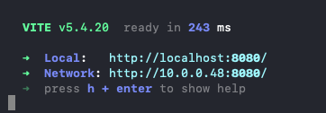

# Starting Your First Livestream

In just a few minutes we'll set up and play your first livestream with Wowza Streaming Engine (WSE), show you how to embed FlowPlayer to create custom user experiences, and also how you can broadcast it to other services like Youtube or Facebook Live.

```
[TODO] EMBED WALKTHROUGH VIDEO HERE
```

# Step 1: Sign up and get your trial license keys
1. [Sign up](https://www.wowza.com/free-trial) for a free trial of Wowza Streaming Engine.
2. Once you've completed the registration process, you'll get your trial license key.
3. [Sign in](https://auth.wowza.com/login) to the Wowza portal to get your Flowplayer video player trial token - you'll need this to later embed it in a custom page.
4. Go to [My Account --> Products](https://portal.wowza.com/account/products), start a Wowza Video trial and then launch Wowza Video.

5. Create a new Flowplayer trial token and store it in a secure place. 


# Step 2: Clone the Dev Guides Github Repo
Clone our Dev Guides Github repo locally - it has Docker files for easily deploying Wowza Streaming Engine, sample code for creating backend modules, and frontend code samples, too.

https://github.com/WowzaMediaSystems/dev-guides

# Step 3: Deploy Wowza Streaming Engine using Docker

1. Download and install [Docker](https://docker.com) on your computer.
2. Download the Docker Compose file in our Dev Guides Github [repo](https://github.com/WowzaMediaSystems/dev-guides/tree/main/1_first_livestream).
3. Copy the `.env.example` file to `.env`:
    ```sh
    cp .env.example .env
    ```
4. Open `.env` and add your Wowza Streaming Engine license key:
    ```
    WSE_LICENSE_KEY=YOUR_LICENSE_KEY_HERE
    ```
5. The Docker Compose setup will automatically use the value from your `.env` file. You can also set your admin username and password in `docker-compose.yaml` if you want to change them from the default.


6. Start the Docker images by running the following command in your terminal:
    ```sh
    docker compose up
    ```

## Notes on Environment Files

- The `.env.example` file provides a template for required environment variables. Copy it to `.env` and fill in your values.
- The `.env` file is ignored by git and should not be committed to version control.
- The license key in `.env` is required to start the container.

# Step 4: Start a Live Stream from OBS Studio
[OBS Studio](https://obsproject.com/) is free and open source software for video recording and live streaming. We'll use this to create a live stream from your local computer using your webcam and microphone.

1. Open OBS Studio
2. Add a new Video Capture Device


3. Select the webcam on your computer


4. You should see your webcam feed now


5. Click on Settings (lower right) and click on `Stream`


6. In the Destination section, set the Server and Stream Key
```
Server: rtmp://localhost/live
Stream Key: myStream
```
7.  Click OK, then `Start Streaming`.


# Step 5: Review the settings in Wowza Streaming Engine
Let's take a quick look inside Wowza Streaming Engine Manager to make sure our feed from OBS is streaming correctly.

1. [Log in](http://localhost:8088/login.htm?host=http://wse.docker:8087) to Wowza Streaming Engine Manager using the admin credentials you set in the docker-compose.yaml file.


2. Once you've signed in, click on Applications in the top navigation, then on `live --> Incoming Streams`.  You should see `myStream` that you started from OBS is now active and Wowza Streaming Engine is receiving the stream data.


3. You can also choose to broadcast your stream to other streaming destinations like Youtube and Facebook Live, but in this tutorial we're just going to focus on streaming to a custom web page.


# Step 6: Embed the Live Stream In a Web App Using Flowplayer
We've built sample web pages using React to show you how to embed Wowza Streaming Engine streams using FlowPlayer, our HTML5 video player for HLS and MPEG-DASH playback for browsers and devices.

https://github.com/WowzaMediaSystems/dev-guides/tree/main/frontend

1. Make sure `node.js` is installed on your machine.  If not, follow these [installation instructions]( https://docs.npmjs.com/downloading-and-installing-node-js-and-npm).

2. In a terminal window, navigate to the `/frontend` folder and install the node packages by typing `npm install`.  Included in the `package.json` file are the FlowPlayer React components to embed them in your web page:

```
@flowplayer/player
@flowplayer/react-flowplayer
```

3. Copy the `.env.example` file in the `/frontend` folder to `.env`:
    ```sh
    cp .env.example .env
    ```
4. Open `.env` and add your Flowplayer trial token:
    ```
    FLOWPLAYER_TOKEN=YOUR_FLOWPLAYER_TOKEN_HERE
    ```
5. The web app will automatically use the value from your `.env` file for secure configuration.

6. Start the web app by typing `npm run dev`. The web app is listening on localhost:8080.
    ```sh
    npm run dev
    ```


7. Open http://localhost:8080/ and you'll see the live stream embedded in the web page.
#
# Notes on Frontend Environment Files
#
- The `.env.example` file in `/frontend` provides a template for required environment variables. Copy it to `.env` and fill in your values.
- The `.env` file is ignored by git and should not be committed to version control.
- The Flowplayer token in `.env` is required to embed the player in your web app.


5. Embedding FlowPlayer in the [page](https://github.com/WowzaMediaSystems/dev-guides/blob/main/frontend/src/pages/LiveStream.tsx) requires providing the stream URL from Wowza Streaming Engine as well as the FlowPlayer token you got as part of the trial signup process.

```
<Flowplayer
    src={videoUrl}
    token={FLOWPLAYER_TOKEN}
    ref={playerRef}
    opts={{
    ui: 1024,
    asel: true,
    fullscreen: false,
    autoplay: true,
    lang: "en",
    }}
    onError={(error) => {
        console.error("Flowplayer component error:", error);
    }}
/>
```

# You Did It!

In subsequent guides, we'll go deeper into:
- Customizing Wowza Streaming Engine to add custom modules and graphical overlays
- Customizing the user experience in FlowPlayer
- Using new and upcoming AI features to provide live subtitling, language translation, and object detection.