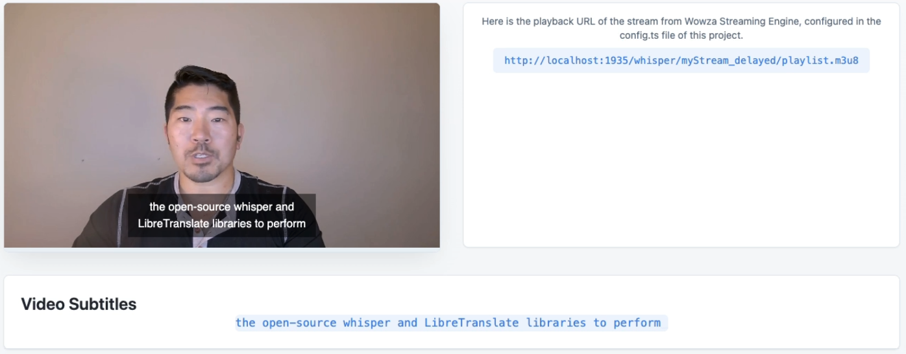
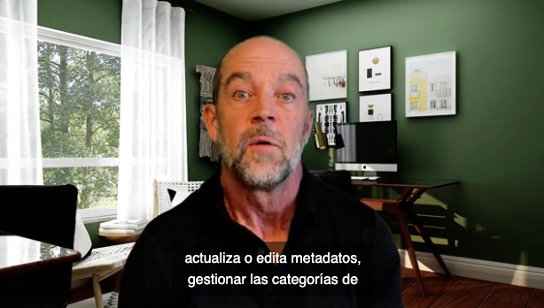
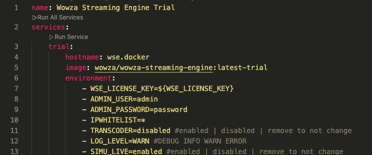
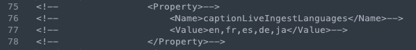
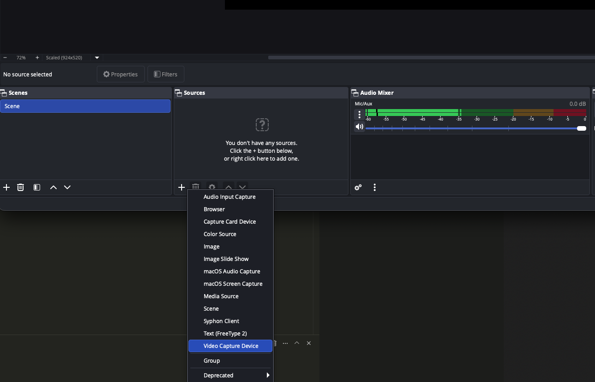
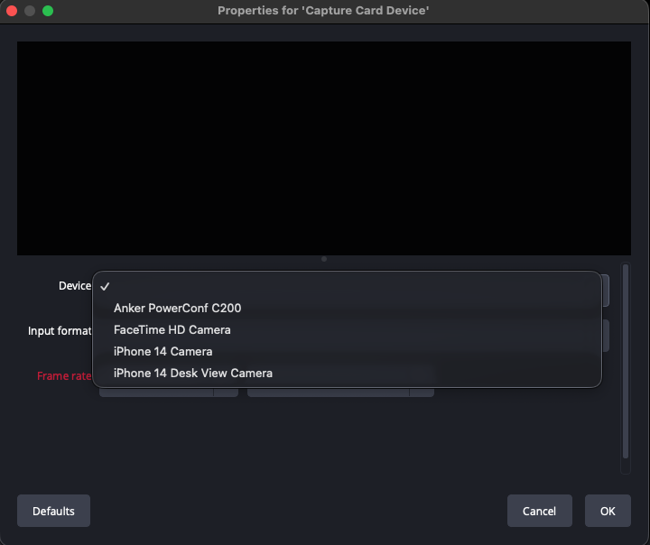
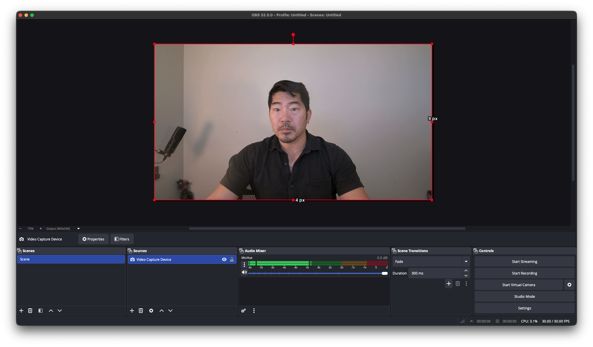
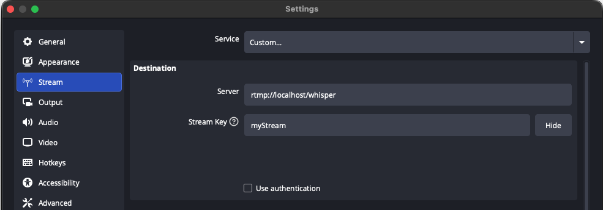
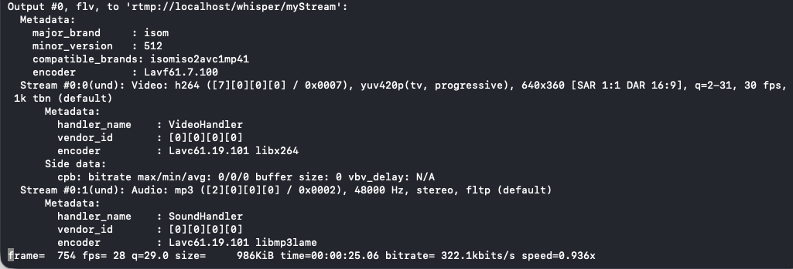
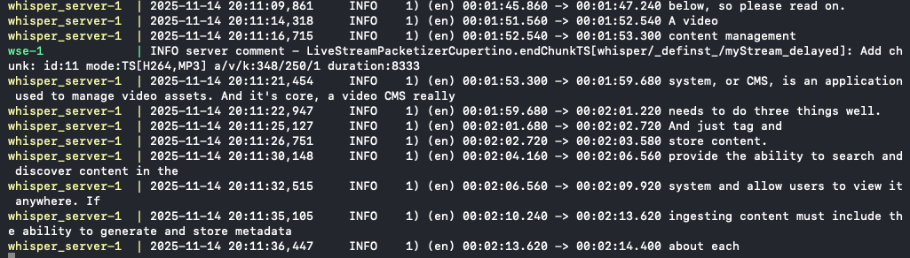

# Developer Guide: Real-Time Subtitles and Language Translation with Wowza Streaming Engine

Generate real-time, AI-generated subtitles and translations with Wowza Streaming Engine (WSE), and display them in a custom React web app using Wowza Flowplayer. 

The code samples provided here are for demonstration purposes only, and are provided via the [Wowza Public License](https://github.com/WowzaMediaSystems/dev-guides/blob/main/LICENSE.txt).

To view the video tutorial, visit [https://www.wowza.com/developer-ai-subtitles](https://www.wowza.com/developer-ai-subtitles).

# How It Works
This demo uses two GitHub repos - one for Wowza Streaming Engine and performs the speech recognition and translation.  The other repo provides a frontend React web app to show how to embed the live stream and gather the AI-generated text tracks to create custom solutions to listen for specific keywords or provide summaries or transcripts of video streams.

Real-time speech-to-text:



Real-time language translation:




## Speech recognition and machine translation
This demo utilizes two Github repos - one for Wowza Streaming Engine configured to work with OpenAI's [`whisper`](https://github.com/openai/whisper), a general purpose speech recognition model, and [`LibreTranslate`](https://libretranslate.com/), a machine translation API. Both are available as open-source projects. 

WSE embeds the [WebVTT](https://www.w3.org/TR/webvtt1/) timed text tracks in the stream containing English, and additional tracks containing translations in Spanish, French, German, and Japanese. 

The [`wse-plugin-caption-handlers`](https://github.com/WowzaMediaSystems/wse-plugin-caption-handlers) repo provides sample code on how to implement this with `whisper` and `LibreTranslate`, useful if use cases include on-prem, secure, edge or offline scenarios.

Alternatively, the sample can be configured to use the Azure speech-to-text service, and serves as an example of how to connect Streaming Engine with other cloud services that may provide domain-specific speech recognition models for industries such as legal or healthcare.  

## Displaying subtitles and text tracks 
The second GitHub repo, [`dev-guides`](https://github.com/WowzaMediaSystems/dev-guides), provides a frontend React web app that embeds Wowza Flowplayer to display the live stream within a web page.

By default, Flowplayer overlays the embedded, synchronized text tracks on top of the video feed.

The text track can also be read by the web app to customize or store the output, or listen for specific keywords in industry-specific scenarios.

# Step 1: Sign up for a trial and set up your environment
To get a trial license key and get this demo working on your local machine, follow the steps in the first developer guide, [Creating a Live Stream](https://www.wowza.com/developer).  

This first developer guide is a good place to start if you are new to Wowza Streaming Engine and will help you deploy your first live stream. It also provides more details and context, such as how the demos utilize environment variables.

Specifically, you'll need to: 
- Sign up for a Wowza Streaming Engine free trial
- Obtain a Wowza Flowplayer token
- Clone the sample frontend GitHub repo: [https://github.com/WowzaMediaSystems/dev-guides](https://github.com/WowzaMediaSystems/dev-guides). 
- (Optional) Install the free and open-source [OBS Studio](https://obsproject.com/) to stream from your webcam

# Step 2: Clone the Caption Handlers Repo
You'll need to clone a second repo which configures Wowza Streaming Engine to provide WebVTT subtitles.

https://github.com/WowzaMediaSystems/wse-plugin-caption-handlers

# Step 3: Deploy Wowza Streaming Engine using Docker

## Option 1: English-only subtitles

1. Download and install [Docker](https://docker.com) on your computer.
2. Open a terminal window and go to the `wse-plugin-caption-handlers` directory.
2. Create a `.env` file:
    - Copy the `.env.example` file to `.env`:
    - Open `.env` and add your Wowza Streaming Engine license key:
    ```
    WSE_LICENSE_KEY=YOUR_LICENSE_KEY_HERE
    ```
5. The Docker Compose setup will automatically use the value from your `.env` file. You can also set your admin username and password in `docker-compose.yaml` if you want to change them from the default.



6. Start the Docker images. In the terminal, run the following command:
    ```sh
    docker compose up
    ```
## Option 2: Translated subtitles
Performing live translation utilizes more computer resources, so it is turned off by default. To enable this capability:
1. Make a backup of the existing `docker-compose.yaml` file. 
2. Rename the `docker-compose-translate.yaml` file to `docker-compose.yaml`.
3. Uncomment lines `75-78` in `conf/whisper/Application.xml`
    
4. Start the Docker images. In the terminal:
    ```sh
    docker compose up
    ```

# Step 4: Start live streaming

## Option 1: Stream live with OBS Studio
[OBS Studio](https://obsproject.com/) is free and open source software for video recording and live streaming. We'll use this to create a live stream from your local computer using your webcam and microphone.

1. Open OBS Studio
2. Add a new Video Capture Device



3. Select the webcam on your computer


4. You should see your webcam feed now


5. Click on Settings (lower right) and click on `Stream`


6. In the Destination section, set the Server and Stream Key
```
Server: rtmp://localhost/whisper
Stream Key: myStream
```
7.  Click OK, then click `Start Streaming`.

## Option 2: Stream an existing video with ffmpeg
Alternatively, you can stream an existing video file utilizing `ffmpeg`. In the `test-videos` subfolder of the [`dev-guides`](https://github.com/WowzaMediaSystems/dev-guides) repo there is a sample video called `barry_360p.mp4`.

1. Download and install `ffmpeg` at [https://www.ffmpeg.org/](https://www.ffmpeg.org/)
2. In a second terminal window, navigate to the `dev-guides/test-videos` folder
3. Run this command to start streaming the video to Wowza Streaming Engine

```sh
ffmpeg -re -y -stream_loop -1 -i ./barry_360p.mp4 \
-vcodec libx264 -f flv rtmp://localhost/whisper/myStream
```

Your output should look similar to this:


## Subtitles and language translation output
In the terminal where Docker is running, you should see the speech-to-text output in the terminal window.  In the next step we'll display this in a web app.


# Step 5: Embed the live stream Using Wowza Flowplayer
Open the `/frontend` subfolder in the [`dev-guides`](https://github.com/WowzaMediaSystems/dev-guides) repo to see how to embed Wowza Streaming Engine streams using Wowza Flowplayer, the HTML5 video player for HLS and MPEG-DASH playback for browsers and devices.

https://github.com/WowzaMediaSystems/dev-guides/tree/main/frontend

1. Make sure `node.js` is installed on your machine.  If not, follow these [installation instructions]( https://docs.npmjs.com/downloading-and-installing-node-js-and-npm).

2. Copy the `.env.example` file in the `dev-guides/frontend` folder to `.env`:
    ```sh
    cp .env.example .env
    ```
3. Open `.env` and add your Flowplayer trial token:
    ```
    FLOWPLAYER_TOKEN=YOUR_FLOWPLAYER_TOKEN_HERE
    ```
4. The web app will automatically use the value from your `.env` file for secure configuration.
5. Start the web app by typing `npm run dev`. The web app is listening on localhost:8080.
    ```sh
    npm run dev
    ```


6. Open http://localhost:8080/ai-transcription and you'll see the live stream embedded in the web page with captions displayed overlayed on the video and on the web page.


